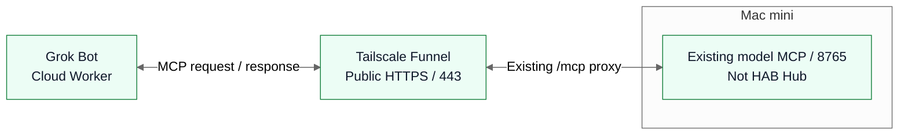

# HAB — Hiraoku Agent Base

HABは、個人文脈を持つDots（スタローン）、クラウドで働くGrok Bot、Macで実験・開発するHermesを、共通のAgent Hubでつなぐための基盤です。依頼・担当・進捗・結果を仲介し、それぞれのエージェントが持つ判断や既存の仕事を尊重します。Claude Code・Codex・Cursorも、将来の開発実行手段として位置づけます。

この公開repoは、Hubのコードに加え、HAB全体の設計・判断・接続状況を管理します。個人のメール・予定・記憶・会話、秘密値、実際の接続設定や運用ログは管理しません。repoは同じ履歴を保持したまま[hiraoku-agent-base](https://github.com/s-hiraoku/hiraoku-agent-base)へ改名しました。

## 全体図

2026-10-10時点の**確認済み経路（本人報告）**です。既存model MCPはHAB Hubとは別サービスです。モデル一覧取得・認証なし拒否の報告は、Hub接続やmodel実行・費用枠の確認を意味しません。

<!-- hab-diagram: hab-current -->



[PNG fallback](docs/diagrams/hab-current.png) · [HABの目標構成・通信方向・認証責任](docs/hab-topology.md)

Hub・Hermesの限定接続は準備段階、Dots/ChatGPT MCPは未検証です。目標構成は詳細文書で確認済み経路から分けて示します。

## 現在可能なこと

「実装済み」はコードとローカルfixtureの確認、「実接続確認済み」は対象の実サービスでの確認を指します。本人報告は独立した実測とは区別します。

| 項目                                                                                       | 状態・根拠                                                                                                                       |
| ------------------------------------------------------------------------------------------ | -------------------------------------------------------------------------------------------------------------------------------- |
| 永続タスクキュー、HTTP MCP、lease/fencing、監査・outbox、停止・照合                        | **実装済み**。SQLiteとローカルD1で失敗系を検証                                                                                   |
| 固定テキストの`connectivity_check`、固定候補metadataの`shift_log_inventory`、診断ping/pong | **実装済み**。信頼済みpolicyで個別に許可する限定契約。自由入力・任意shellなし                                                    |
| JWT/Auth0 resource-server、OAuth discovery、Events、限定キー管理、Hermes隔離bridge         | **実装済み**。通常runtimeと専用inventory入口の認証配線をfixtureで検証。本番の主体・設定・実接続は未確認                          |
| Hermesの今回のinventory接続                                                                | **準備済み／実接続未確認**。専用profile・code・dependency bundleと本人Terminalの測定報告あり。実キー/API/model起動・往復は未実施 |
| 既存の別MCPとTailscale/Grok                                                                | **本人報告による実接続確認済み**。認証なし拒否も報告済み。HAB Hubへの接続やHubのOAuth成功を証明しない                            |
| Dots ↔ Hub ↔ Grok本番、開発実行手段のHub接続                                               | **計画**。Cursor利用可能性は本人見込み。Claude Channelはmock、Cua起動は未完                                                      |

実装baselineのCIではNode 292件・Python 23件、lint・typecheck・build・Ruffが成功し、依存auditは0件でした。これは本番接続の受入れではありません。最新のゲートは[MVP受入れ表](docs/mvp-acceptance.md)で管理します。

## 残しておく7項目

| 文書                                          | 内容                                                           |
| --------------------------------------------- | -------------------------------------------------------------- |
| このREADME                                    | HABの目的、全体図、現在可能なこと、入口                        |
| [設計思想](docs/hab-principles.md)            | 個人文脈・Cloud Worker・Local Agentの分業、疎結合、費用制約    |
| [役割と機能](docs/hab-roles.md)               | Dots／Grok／Hermes／Claude Code／Codex／Cursorの担当と接続状況 |
| [処理の流れ](docs/hab-workflow.md)            | 依頼 → 振分け → 承認 → 実行 → 結果、失敗・停止・照合           |
| [セキュリティ](docs/hab-security.md)          | Auth0、Tailscale、権限、秘密、停止と公開境界                   |
| [設計判断記録（ADR）](docs/hab-decisions.md)  | 採用理由、不採用・保留・未決定案                               |
| [競合比較とロードマップ](docs/hab-roadmap.md) | 一次資料に基づく参考実装と段階的な接続計画                     |

## ローカル再現

Node 24以上で実行します。fixtureは実エージェントや本番callbackへ接続しません。

```sh
npm ci
npm run lint
npm run typecheck
npm test
python3 -m unittest hermes_bridge.test_inventory_agent hermes_bridge.test_launch_manifest
```

`node src/server.ts` はloopback HTTP MCPを起動しますが、既定の認証は全件拒否です。Auth0・peer registry・必要なserviceを明示的に配線するまで本番Hubとして公開しません。`npm run build` はWorker版を生成します。D1/Workerは移植性の検証対象で、現在の本番方針はMac＋SQLiteです。

通常runtimeはinventoryを拒否します。固定1件の専用入口と、認証→子プロセス→結果→停止のモデルなし統合テストは[専用inventory往復](docs/inventory-end-to-end.md)を参照してください。実キー発行・Hermes/model起動の承認や本番往復を済ませたという意味ではありません。

## 技術文書

[Hub内部設計](docs/architecture.md)、[認証・Events・worker](docs/local-integration.md)、[Auth0境界](docs/auth0-boundary.md)、[ping/pong](docs/ping-pong-mvp.md)、[inventory MVP](docs/mvp-inventory.md)、[Hermes接続](docs/hermes-connection.md)、[固定pilot履歴](docs/fixed-pilot.md)、[import隔離](docs/hermes-import-boundary.md)、[一時キー](docs/local-hermes-key.md)、[永続停止](docs/durable-stop-gate.md)、[移植とEvents](docs/migration-plan.md)、[Auth0アカウント手順](docs/auth0-account-step.md)を参照してください。実運用の手順・値は承認後に非公開で管理します。
