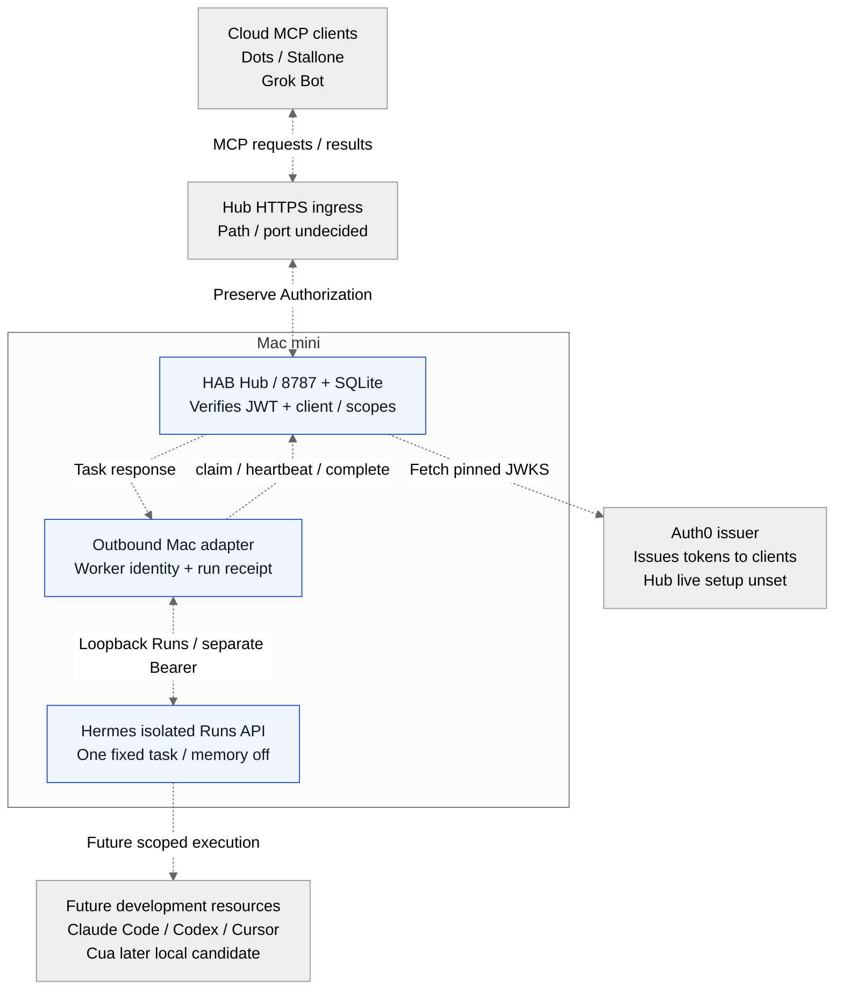

# 最新構成と接続予定

[READMEへ](../README.md) · [役割と機能](hab-roles.md) · [セキュリティ](hab-security.md) · [ADR](hab-decisions.md)

2026-10-10時点。**Markdown内のMermaidが正本**です。READMEに[確認済みの既存経路](../README.md#全体図)、ここにHABの接続予定を載せます。同じソースからPNG fallbackを生成します。手描きSVGと独立した`.mmd`の二重管理は廃止しました。

## HABの接続予定

すべての破線は**未接続・計画**です。青枠はコードとfixtureを確認した部品で、本番稼働を意味しません。Auth0はMCP trafficのproxyではありません。

<!-- hab-diagram: hab-target -->



[PNG fallback](diagrams/hab-target.png)

## 確認範囲と凡例

- **READMEの実線／緑**：既存Funnel443の`/mcp`から既存model MCPへのproxy、およびGrokの接続成功は本人報告です。既存serviceの認証なし拒否とモデル一覧取得も報告済みです。HAB Hubの本番接続ではありません。
- **破線**：接続予定です。Hub用の追加path/portは未決定・公開未承認。8443は候補ですがclient製品の対応は未検証です。
- **青枠**：repoのコード・mock実測で確認した部品です。Hubのdefault entrypointは401で、本番Auth0・peer/service配線は未完です。
- **本人報告と実測**：本人TerminalのHermes測定報告を受領し、code内容のhashも照合済みです。実processの起動・tool境界・listener・本番往復の証明ではありません。

今回のHermes inventoryは専用profileと固定dependency準備までです。実一時key・API・model・往復は未実施で、fresh Inspector/private binding、実行環境、既存モデル枠の追加料金0確認が残ります。既存Desktop/profile/auth/cronは変更しません。

Dots/ChatGPT MCPは未検証で本人のChromeログイン待ちです。Cursorは本人の利用可能性見込み、Claude Code Channelはmock、Codexによるrepo作業はHub executor接続の証拠ではありません。Cuaは後続のlocal候補で起動未完です。開発resourceのMac/cloud配置・権限はtoolごとに決め、図の破線から一般的なshell権限を得られるものではありません。

## 通信と認証の責任

| 通信                  | 方向と責任                                                                                                                                                                          |
| --------------------- | ----------------------------------------------------------------------------------------------------------------------------------------------------------------------------------- |
| 既存MCP経路           | GrokのrequestはFunnel→既存model MCP、responseは逆方向。既存serviceが認証を担当し、具体方式は未確認。Hub用Auth0とは別物                                                              |
| Dots/Grokの依頼・取得 | client→Hubの`submit/get`や診断`ping_*`、結果はresponseとして逆方向。自動受信やGrok起動を示す線ではない                                                                              |
| OAuth                 | clientがAuth0へauthorizationを要求しtokenを受け取り、HubにBearer tokenを提示する。図ではissuerの役割を箱内に示し、clientのauthorization/redirect/callback/token endpointのhopは省略 |
| Hubの認証・認可       | Hubが固定issuer/audience・署名・期限を検証し、subject/client/scopeとpolicyで操作を決める。JWKSはHub→固定Auth0 URLで取得。Auth0へMCP requestを中継しない                             |
| Mac worker            | adapter→Hubのclaim/heartbeat/completeとHub→adapterのtask response。外向き通信であり、HubがMac workerのlistenerへ仕事をpushする構成ではない。worker identityはuser OAuthと別に要設定 |
| Hermes Runs           | adapter→loopback APIへ固定request、API→adapterへrun/status/result。Hermes API BearerはHub OAuth・model account認証とは別用途。一時key lifecycleコードは本番配線前                   |
| Grok wake・通知       | 実transport/receiverは未接続。HTTP受付だけで完了にしない。図の結果responseからGrok model/CLI起動や新task生成を推測しない                                                            |

8787はHubのコードが指定するloopback portで、稼働中listenerを確認した意味ではありません。既存model MCPの8765は本人提供設定のcomponent情報です。実hostname、tenant、個人path、秘密と運用出力は公開図に含めません。

## 正本からの再生成

[renderer](diagrams/render-mermaid.mjs)はMarkdownの指定Mermaid blockをそのまま抽出して、公式Mermaid CLI 12.0.0で構文検証・PNG生成します。図ごとの別ソースや手描き座標はありません。[manifest](diagrams/manifest.json)はMermaidとPNGのSHA256を保持し、`--check`で未再生成の変更を検出します。GitHubではnative Mermaidを表示し、PNGはfallbackです。[GitHubのMermaid対応](https://docs.github.com/en/get-started/writing-on-github/working-with-advanced-formatting/creating-diagrams)、[公式CLI](https://github.com/mermaid-js/mermaid-cli)を参照してください。

```sh
# Optional renderer tools stay in ignored runtime; app dependencies do not change.
PUPPETEER_SKIP_DOWNLOAD=true npm install --prefix runtime/mermaid-renderer --ignore-scripts --no-audit --no-fund --save-exact @mermaid-js/mermaid-cli@12.0.0 puppeteer@25.13.0 mermaid@12.1.0
# Point to a local browser executable; a fresh private profile is used.
HAB_DIAGRAM_BROWSER=/path/to/browser node docs/diagrams/render-mermaid.mjs
node docs/diagrams/render-mermaid.mjs --check
```

rendererは既存browser profileを開かず、local描画専用の一時profileとpipeを使い、外部URL解決を無効化します。service設定・Hub公開route・認証・deployは変更しません。図の変更時は[役割表](hab-roles.md)、[受入れ表](mvp-acceptance.md)とこの確認範囲を整合させます。
