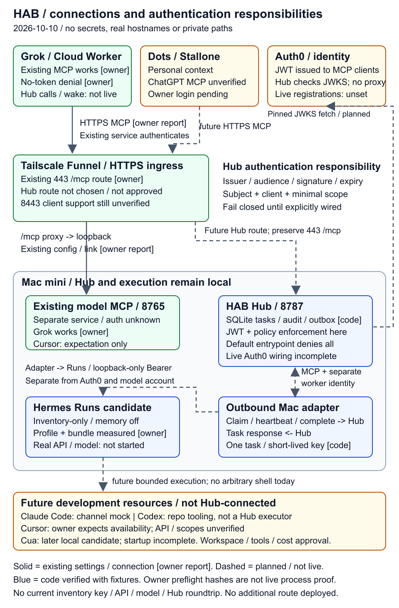

# 最新構成図

[READMEへ](../README.md) · [役割と機能](hab-roles.md) · [セキュリティ](hab-security.md) · [ADR](hab-decisions.md)

2026-10-10時点の構成です。READMEは縦長の概要PNG、このページは通信・認証の詳細PNGを表示します。SVGは拡大用、Mermaidは編集用です。同じ対象を二つの粒度で示し、既存の目標図はREADMEから置き換えました。



[詳細SVG](diagrams/hab-connections.svg) · [詳細Mermaidソース](diagrams/hab-connections.mmd) · [概要SVG](diagrams/hab-overview.svg) · [概要Mermaidソース](diagrams/hab-overview.mmd)

## 凡例と確認範囲

- **実線／緑**：既存設定または接続の本人報告。Grokから既存model MCPへの通信、Funnel443の既存`/mcp` proxy、認証なしの拒否を確認したとの報告です。HAB Hubの接続成功ではありません。
- **破線**：計画または未接続の通信です。線があっても新route・port・grant・常駐が承認済みとは限りません。
- **青／code**：repoで実装とfixtureを確認した部品です。実processや本番接続の実測を意味しません。
- **owner／本人報告**：本人の実環境からの報告です。独立した実測と区別します。今回のHermes測定はcode内容の確認で、実API/listener/model起動の証明ではありません。
- **黄**：計画・未検証です。Cursorは本人の見込み、Dots/ChatGPT MCPは未検証で本人のChromeログイン待ちです。Claude Code Channelはmock、Cuaは後続で起動未完です。

既存model MCPからのモデル一覧取得は本人報告です。カタログが取得できてもモデル実行、費用枠、Hubへの接続が確認されたことにはなりません。実hostname、tenant ID、個人path、秘密、実行ログを図に含めません。

## 通信方向と認証の責任

| 通信                                                                 | 現状・責任                                                                                                                      |
| -------------------------------------------------------------------- | ------------------------------------------------------------------------------------------------------------------------------- |
| Grok → Funnel → 既存model MCP、応答は逆方向                          | 本人報告で接続済み。既存serviceが認証を担当。Auth0 Hub認証とは別物で、具体的方式は未確認                                        |
| Dots/Grok → Hub用入口 → Hub、結果は逆方向                            | 未接続。Hub用path/portは未決定・公開未承認。同host別pathのdiscovery衝突、8443の製品対応、token転送を検証する                    |
| MCP client → Hub：OAuth access token                                 | 計画。tokenを受け取るHubでissuer/audience/署名/期限、subject/client/scopeとpolicyを検証。default entrypointは拒否               |
| Hub → Auth0：固定JWKS取得、Auth0 → client：OAuth発行                 | 検証部品は実装済み、live設定未完。Auth0はMCPリクエストのproxyではない。図の矢印はJWKS取得側を示し、tokenはclientがHubへ提示する |
| Mac adapter → Hub：claim/heartbeat/complete、Hub → adapter：task応答 | コード・mock実装済み。workerは外向き通信で受け取り、独自の検証済みworker identityを必要とする                                   |
| Mac adapter → Hermes Runs API、応答は逆方向                          | 今回の実接続は未実施。loopback専用の一時Hermes BearerはHub OAuthやmodel account認証とは別用途                                   |
| Hermes → 開発resource                                                | 将来の限定executor接続。CLIの存在、repo作業への利用、別MCP接続はHub adapterを証明しない                                         |

図中の8787/8765はcomponentの説明用loopback portです。Hubの既存entrypointが8787を指定することは、稼働中listenerの確認ではありません。今回のinventory API portとprivate launch bindingは承認済みの実行時policyで固定し、公開入口にしません。

## 更新と再現

図を変更するときは、対応するMermaid、[SVG生成source](diagrams/render.py)、この確認範囲、[役割表](hab-roles.md)と[受入れ表](mvp-acceptance.md)を同時に更新します。PNGは外部imageや実運用画面ではなく、SVGからの静的描画です。標準Pythonと既存の`rsvg-convert`で再現できます。

```sh
python3 docs/diagrams/render.py
rsvg-convert docs/diagrams/hab-overview.svg -o docs/diagrams/hab-overview.png
rsvg-convert docs/diagrams/hab-connections.svg -o docs/diagrams/hab-connections.png
```

この図の更新ではservice設定・公開route・認証・deployを変更しません。
