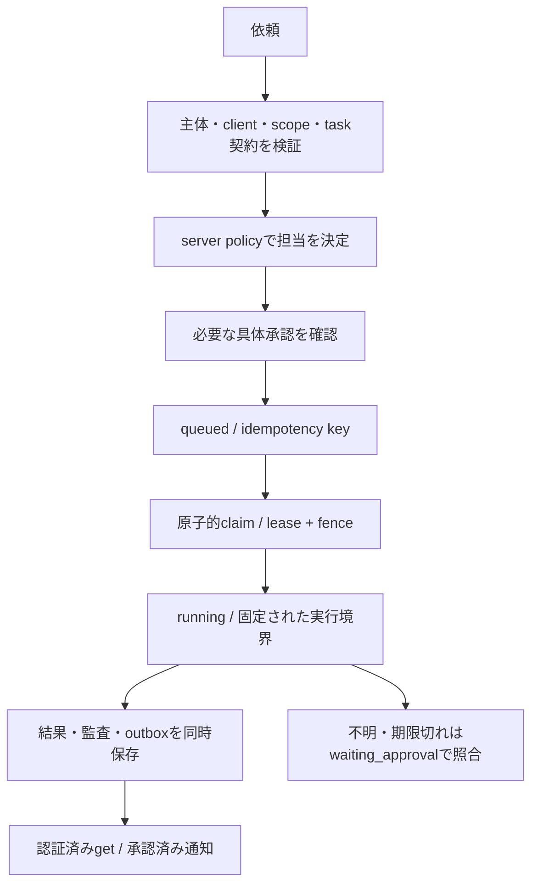

# 依頼から結果まで

[READMEへ](../README.md) · [内部設計](architecture.md) · [セキュリティ](hab-security.md)

以下は目標フローと、実装された限定契約の対応です。Dots/Grokの本番接続や任意の仕事の振分けは未実施です。

## 1. 依頼・振分け

requesterは許可済みtask typeとrequest keyを送ります。自由な宛先・URL・shell・個人データは初期契約にありません。Hubは署名検証された主体とpolicyから宛先・操作を決め、request keyをowner単位で重複排除します。診断ping/pongはsubject/client単位の別契約です。

一般的な会話を自動分類して実行するrouterは計画です。現在のHub routingは明示的な固定taskとpolicyです。責任者、環境、tool、workspace、完了条件が不明な依頼は、権限を推測して実行しません。

## 2. 承認

実agent・公開経路・新credential・新scope・常駐・費用を伴うときは、接続先、渡すデータ、操作、実行回数、時間、停止方法を具体化します。初期接続はsupervised one-shotです。`waiting_approval`は安全な保留状態であり、承認UIやapproval tokenが本番実装済みという意味ではありません。

## 3. 実行・進捗

外向きMac adapterが原子的claimを行い、期限付きleaseと増加するfenceを取得します。heartbeatでleaseを更新し、run IDを一度だけbindします。古いfenceや他workerのcompleteは拒否します。並列1は未解決の取消実行も数えます。

admission前にMac journalへtask/fence/keyを保存します。再起動では既知run IDを取得し、応答不明のadmissionは同じkey・同じ境界・保証された保持期限内だけで照合します。期限を延ばしたり、別toolへ投げ直したりしません。

## 4. 結果・通知

固定schemaの結果、audit、terminal outboxを同一transactionで保存します。認証済み`get`で取得する方式を最初の接続候補にします。後続のEvents配送は許可済みcallbackだけで、event IDを重複排除し、期限・権限・回数を毎回確認します。通知から新taskは作成しません。

Hubの状態は`queued / running / waiting_approval / succeeded / failed / cancelled`です。HTTP 200やwake受付は完了ではありません。承認済みrunの結果と相関が一致して初めて完了を認めます。

## 5. 失敗・取消・停止

lease失効や不明なadmissionはslotとreceiptを保持して保留します。取消はfenceを無効化しますが、remote runの停止を意味しません。local abortも送信済みの仕事を取り消せません。

内部operator reconcileは、元のrun ID・scope・fenceと信頼済み実行境界で、固定成功結果を確認できた場合にのみslotを閉じます。一般的な失敗／取消terminalを理由に解放する機能は未実装です。秘密を再発行したり、繰返し送信したりせず、人が不明状態を調べます。詳細は[認証・worker・照合](local-integration.md)を参照してください。
